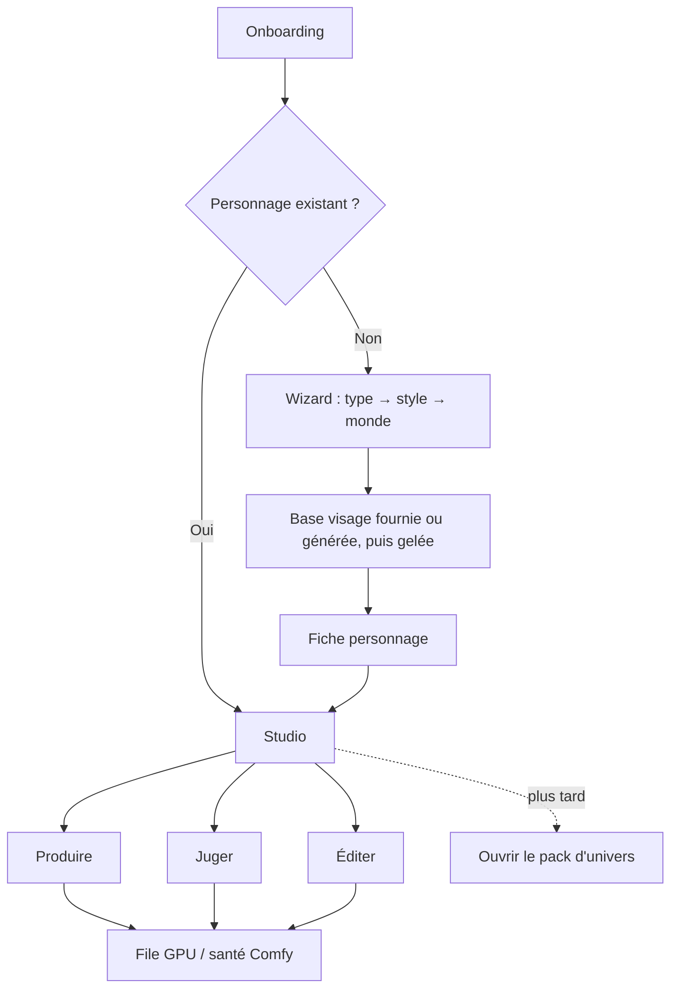
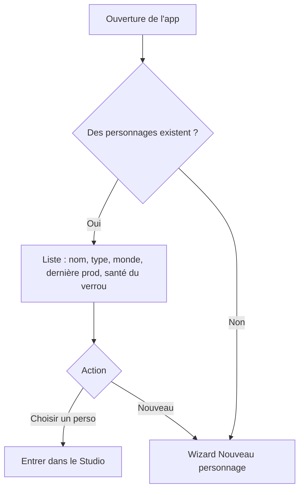
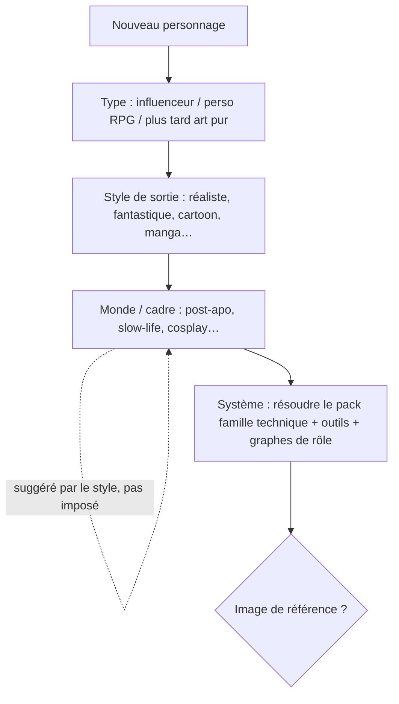
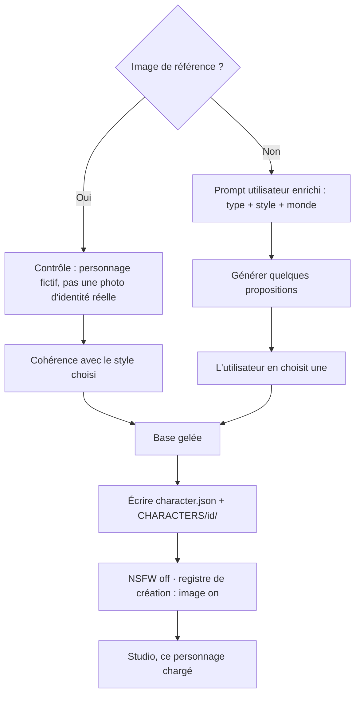
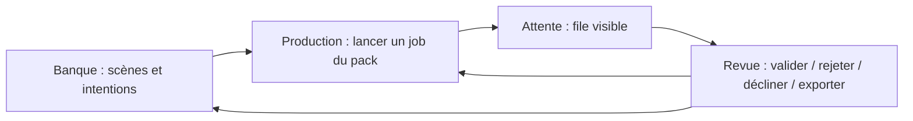
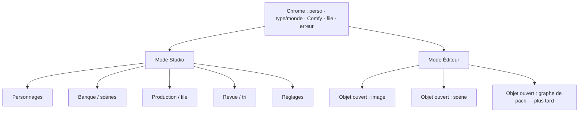
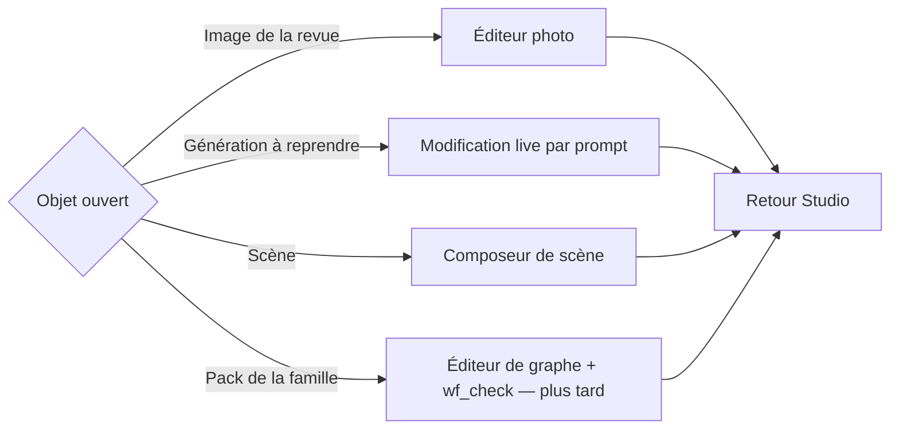
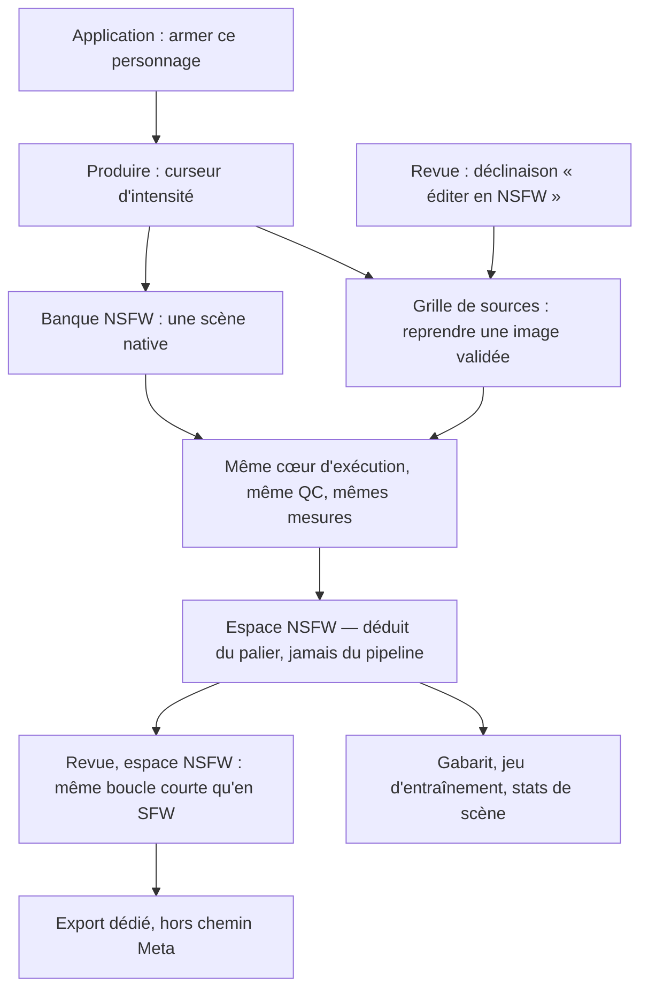
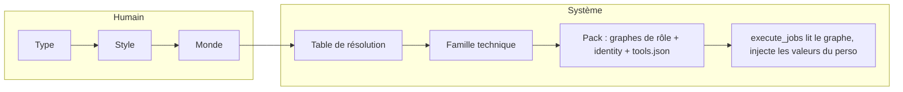
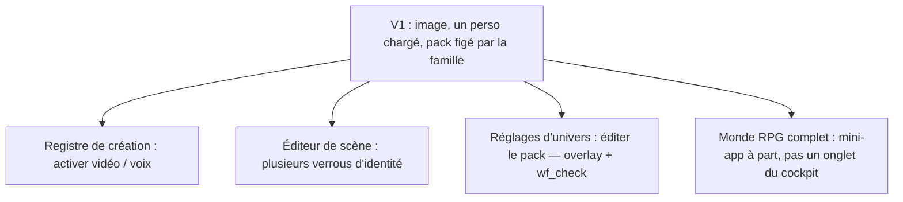

# Flux d’usage global — Soulglade

Document de cadrage produit. Ce n’est pas `CLAUDE.md` (règles) ni `ROADMAP.md` (jalons) : c’est ce que l’humain *fait* dans le studio.

Lecture unique : objets du studio. Les graphes ComfyUI restent en coulisse.

- Un personnage n’est pas un workflow.
- Une famille technique possède un **pack** de graphes de rôle.
- Deux modes seulement : **Studio** (gérer, produire, juger) et **Éditeur** (ce qui est ouvert).
- « Avancé » n’est pas un écran cible.

---

## Carte mentale

---

## 1. Entrée

L’app s’ouvre sur un **sas**, pas sur l’écran de production d’un personnage par défaut.

Dès qu’un personnage est chargé, le chrome affiche :

| Zone | Contenu |
|---|---|
| Identité | Personnage actif |
| Contexte | Type + monde |
| Système | Comfy joignable ou non |
| Travail | File de jobs |
| Vérité | Dernière erreur, message actionnable |

Sans ce chrome, on n’est pas dans le studio.

---

## 2. Naissance d’un personnage

L’humain choisit une intention. La famille technique se **résout** en coulisse (table déclarative, pas un `if` personnage). Aucune étape « attribuer un workflow ».

Le style de sortie est **figé** à la création. En changer = créer un autre personnage.

Le monde est un cadre narratif (banque, ton, peau). Il ne choisit pas le checkpoint.

### Base visage

Toujours un **choix humain**. Jamais de gel automatique.

Mesure du verrou d’identité (poids LoRA / PuLID, seuils) :

- **V1 honnête** — défauts du pack, recalibrage plus tard dans Réglages.
- **V1 complète** — première série de tests dans le wizard (plus long, GPU).

Leçon déjà apprise : la mesure est **par personnage**. Le mécanisme du pack peut dégrader l’identité ; on ne « répare » pas ça en créant un graphe parallèle.

---

## 3. Journée type dans le Studio

Une fois un personnage chargé, le quotidien est une boucle courte. On peut juger pendant qu’un job tourne.

Règle d’or : une **référence de scène sert à la composition, jamais à l’identité**. Le visage vient du verrou du pack, paramétré par le personnage.

### Carte du Studio

Les outils du panel viennent du `tools.json` de la famille, jamais d’un `if character == "…"`.

| Portée | Exemples |
|---|---|
| Globaux | Édition d’image, modification live par IA, posing |
| Métier | Outils lifestyle influenceur, lore RPG, etc. |

Changer de personnage est un geste du chrome. Banques, production et exports restent isolés par `character_id`.

---

## 4. Mode Éditeur

On n’entre pas dans un fourre-tout. On **ouvre un objet**. Fermer l’éditeur ramène au Studio, même personnage, même file.

Le runner **lit** le graphe au lancement. Il ne l’écrit pas pendant un job.

---

## 5. NSFW — une branche, pas un monde

**Amendé le 2026-09-21** (`2026-09-21-flux-nsfw.md`). La version d'août
décrivait un flux — sélectionner une image SFW, la passer à l'outil de
modification live — qui n'a jamais été celui du code : le NSFW est un
**palier du curseur d'intensité**, pas un outil à part, et il a deux portes
d'entrée, pas une. Le reste du principe tient sans changement : réglage off
par défaut à la création, armement explicite, visible, réversible, pas
d'onglet parallèle, pas de génération automatique, pas d'entrée dans le
wizard.

L'armement a **une seule porte** : l'écran Application, jamais au milieu d'un
geste de production. Un palier qui demande l'armement et ne l'a pas n'apparaît
pas dans le curseur — absent, pas grisé.

Deux axes qu'il ne faut pas confondre, et que la version d'août confondait :

| Axe | Ce qu'il dit | Qui le décide |
|---|---|---|
| Palier d'intensité | ce que l'image montre, et si elle est publiable | l'utilisateur, au curseur |
| Espace SFW/NSFW | où elle est rangée, et par quelle sortie elle part | déduit du palier |

La voie native et la voie d'édition sont deux façons d'alimenter le **même**
palier : partir d'une scène de la banque NSFW, ou reprendre une image déjà
validée. Aucune des deux n'a de cœur d'exécution, de graphe ou d'écran à elle
(invariants 2 et 9).

Même flux plus tard pour la vidéo, une fois la vidéo SFW branchée.

## 6. Coulisses — ce que l’utilisateur ne gère pas

Invisible dans le parcours quotidien :

- quel fichier `*_prod_ui.json` tourne ;
- `ui_to_api`, titres de nœuds ;
- la résolution vers Flux ou SDXL ;
- SQLite.

Visible en petit, pour le debug seulement : `machine : Flux · verrou visage`. Ce n’est pas un cran du wizard.

---

## 7. Extensions sans casser le flux

Éditer un pack (humain, puis assistant MCP / Qwen) est une action de **Réglages d’univers**, jamais une étape de naissance du personnage. Tant qu’un ADR n’a pas levé l’invariant : MCP = lecture et validation seulement.

---

## Phrase de nord

On crée un être (type, style, monde, visage choisi), on le charge, on compose, on fait tourner la machine de son pack, on juge, on édite l’objet ouvert — et on recommence, sans jamais penser à un workflow.
