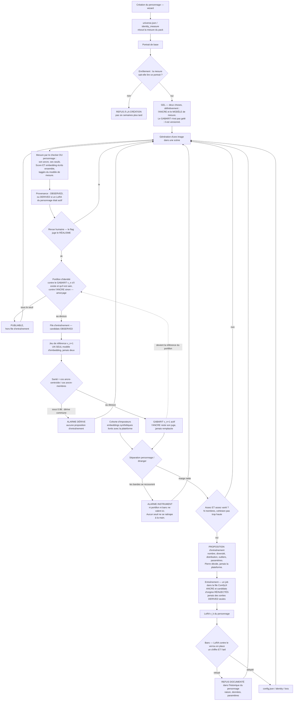

# Le LoRA d'identité par personnage

Cadrage ouvert le 2026-09-09, à la clôture d'IT-3b et avant l'ouverture
d'IT-4. Trois questions comme tout cadrage (règle 3, `PROJET.md`), plus
une quatrième posée par Pierre le jour même, et qui est la vraie raison
d'écrire ce fichier : **l'entraînement du LoRA entre-t-il dans la
plateforme ?**

## Ce qui le déclenche

IT-3b a fermé l'étape peau sur un constat d'architecture, pas sur un
gain : **l'identité et la texture de peau sont le même curseur.** Mesuré
au banc le 09/09 sur `identity_weight` (0.85 → 0.65 : −0,092 d'identité
à 6,2 σ, 5 images OK sur 5 puis 0 sur 5). Le lissage plastique est un
défaut connu de PuLID-Flux, pas un réglage à trouver.

La sortie connue est ailleurs : remplacer l'adaptateur par un LoRA
entraîné. Inscrit en E2 le 09/09 (92-98 % de consistance contre 80-88 %),
et le dépôt l'a déjà mesuré lui-même — voir ci-dessous.

Conséquence sur le tableau de bord, à corriger : IT-4 annonce encore
« bloquant identifié le 08/09 : le rendu de peau et de fond (E5) ». Les
deux sont fermés. **Ce bloquant a changé de nature et d'EPIC** : il n'est
plus un réglage de graphe à trouver (E5), il est le mécanisme d'identité
de production (E2). C'est ce chantier.

## L'état réel du dépôt, vérifié dans le code

Cinq faits, tous relus le 09/09 — pas des souvenirs de doc.

1. **Le mécanisme de consommation existe et tourne en production.**
   `AUTOMATION/identity/lora_sdxl.py` porte un rôle optionnel
   `character_lora` (`LoraLoaderModelOnly`), piloté par
   `config.json / identity / lora` : `name`, `strength`, `trigger_word`.
   Le mot déclencheur est préfixé au prompt positif.
2. **Abyssiaelle roule dessus depuis J6.** `abyss1a_v1.safetensors`,
   entraîné le 20/07/2026 sur 53 images, mot déclencheur `abyss1a`. Le
   fichier est physiquement présent dans `models/loras/`. Et sa mesure
   dit quelque chose d'important pour la suite : pour ce personnage,
   l'IPAdapter FaceID a dû descendre à **0.0** — le LoRA porte seul
   l'identité réelle.
3. **Le débypass est déjà générique, hors de tout module d'identité.**
   `AUTOMATION/runner/comfy.py` (bloc « LoRA de personnage ») force le
   nœud actif via `node_modes` dès que `identity.lora.name` est
   renseigné et que le rôle existe. Ce code ne connaît ni SDXL, ni Flux,
   ni un personnage : il est déjà agnostique (invariant 7).
4. **Le côté Flux ne l'a pas.** `AUTOMATION/identity/pulid_flux.py`
   n'expose que `pulid_apply` et `pulid_ref`. Aucun `character_lora`.
   **Le manque côté Léna est dans le module d'identité, pas dans le
   graphe.**
5. **Le graphe de Léna porte déjà le nœud** — `LoraLoaderModelOnly`,
   titre « LoRA realisme (bypass) / futur LoRA Lena ». Mais il en porte
   **deux** de ce type, et `ui_to_api.find_node` refuse un type ambigu
   sans titre : `character_lora` résoudrait à `None`, et `apply` lèverait
   son erreur explicite. Il faut donc que le rôle porte un titre attendu.
   C'est une **édition de graphe**, donc une validation par Pierre dans
   ComfyUI (invariant 1 amendé).

## À quoi ça sert, et pour qui

**Pour Pierre d'abord, cette semaine.** IT-4 est une semaine de
production Léna. Chaque image de cette semaine passe par le curseur
identité/texture. Si le LoRA le desserre, la semaine produit des images
qu'on garde ; sinon elle produit une semaine de peau plastique et on
l'aura su après.

**Pour l'utilisateur cible ensuite, mais pas tout de suite.** Le LoRA
d'identité n'est pas dans le parcours nominal : le wizard crée un
personnage avec PuLID ou IPAdapter et produit sa première image sans
entraîner quoi que ce soit. Le LoRA arrive quand un personnage **passe
en production**, ce qui est la deuxième semaine d'un utilisateur, pas sa
première heure. C'est la règle 2 appliquée, et elle décide de la suite.

**Jamais un traitement Léna.** Tout personnage doit pouvoir porter le
sien, quel que soit son pack. C'est déjà vrai côté SDXL ; le rendre vrai
côté Flux est du rattrapage de parité entre deux mécanismes d'identité,
pas une nouvelle capacité.

## La question architecturale : kohya_ss au cœur du projet ?

### Ce que kohya_ss expose vraiment

Vérifié le 09/09. `kohya-ss/sd-scripts` est un jeu de **scripts CLI** —
`sdxl_train_network.py`, `flux_train_network.py` — pilotés par un fichier
de configuration TOML. `bmaltais/kohya_ss` est une **GUI Gradio** posée
par-dessus, plus un CLI. Aucune API REST headless documentée.

Donc l'interface stable, si on intègre, c'est **sd-scripts en
sous-processus avec un TOML généré**, jamais l'endpoint Gradio de la GUI
— non versionné, il change avec l'interface. Le dépôt sait déjà piloter
un processus externe long et en rendre compte à l'écran :
`AUTOMATION/comfy_server.py` fait exactement ça pour le serveur ComfyUI
(démarrer, arrêter, relancer, statistiques). Le patron existe.

### Les cinq coûts, nommés

1. **Un second environnement Python complet.** torch, accelerate,
   bitsandbytes, xformers — plusieurs Go, avec ses propres conflits de
   version contre le `python_embeded` de ComfyUI. E10 dit « chaîne
   d'outils portable, tout reste dans le dépôt » : ça double la surface
   d'installation, et ça tombe sur l'EPIC le moins avancé du tableau
   (3/6, dont « installation de bout en bout vérifiée par un tiers »,
   jamais faite).
2. **Un seul GPU.** Un entraînement dure des heures sur la carte qui
   produit. Il n'y a qu'un état d'exécution dans tout le projet
   (`shared_state.STATE`, un batch à la fois, commenté comme tel). Un
   entraîneur intégré est un second consommateur de GPU qui bloque la
   production — exactement le problème que la file d'attente serveur
   (E4, à faire) ne résout pas encore.
3. **Le jeu de données.** Un LoRA se forme sur des images légendées.
   Léna a 78 images triées OK, largement au-dessus des 15-30 demandées,
   mais la légende, le recadrage et le mot déclencheur sont un métier à
   part — et la banque ne les porte pas.
4. **Flux entraîne plus cher que SDXL.** Ce qui a marché pour
   Abyssiaelle en juillet ne dit rien du coût côté Léna.
5. **Ce n'est pas le cœur.** `PROJET.md` : « son centre est le créateur
   de scène ». Un entraîneur est un atelier de fabrication de brique. Ça
   ne l'interdit pas, ça le classe.

### Ce qui plaide pour, quand même

Si le LoRA devient le mécanisme d'identité de tout personnage qui passe
en production, alors l'étape est dans le parcours de **tout créateur
sérieux**, pas seulement dans celui de Pierre. Et un pack vendable qui
livrerait un personnage de démonstration livrerait un LoRA : la chaîne
de fabrication devient un actif du modèle économique, pas une commodité.

C'est un argument réel. Il ne dit pas « maintenant ».

### La découpe retenue

**Étage 1 — brancher. C'est ce chantier, avant IT-4.** Parité Flux/SDXL
sur `character_lora`, entraînement du LoRA de Léna **à la main, hors
plateforme**, exactement comme Abyssiaelle en juillet. Zéro architecture
nouvelle.

**Étage 2 — trancher la couche. Un ADR, pas une itération.** « Quelle
couche porte l'entraînement » est une question ADR-0017 : la réponse
probable est *plateforme* (invariant 7 — jamais un pack, jamais un
personnage, et jamais un `if character ==`), mais elle se démontre, elle
ne se suppose pas. À écrire quand l'étage 1 aura donné un chiffre : si
le LoRA ne desserre pas le curseur, l'atelier n'a pas de raison d'être.

**Étage 3 — l'atelier lui-même. Horizon.** Hors parcours nominal par la
règle 2. Il monte en EPIC par cadrage explicite, jamais par envie.

## Périmètre de ce chantier (étage 1 seulement)

1. Sortir le bloc d'injection LoRA de `lora_sdxl.apply` — une quinzaine
   de lignes qui ne dépendent que des rôles `character_lora` et
   `positive` et de `identity.lora`, donc **déjà agnostiques de la
   famille de modèle** — vers un helper partagé de
   `AUTOMATION/identity/__init__.py`, appelé par les deux mécanismes.
   Réutilisation, pas réécriture.
2. Déclarer `character_lora` dans `pulid_flux.REQUIRED_ROLES`, avec un
   **titre attendu** (le type seul est ambigu dans le graphe de Léna).
3. Éditer le graphe de Léna pour que le nœud porte ce titre, et le faire
   valider dans ComfyUI par Pierre (invariant 1 amendé). Occasion de
   retirer « Lena » du titre — c'est aussi la dette E1.
4. Entraîner le LoRA de Léna hors plateforme, sur ses images triées OK.
5. Renseigner `CHARACTERS/lena/config.json / identity / lora`.
6. Passer le banc. Les axes existent depuis le 09/09 : `identity_weight`
   croisé avec la force du LoRA. **La mesure d'Abyssiaelle est
   l'hypothèse à tester** : son IPAdapter a dû descendre à 0.0 pour que
   le LoRA porte l'identité ; le poids PuLID de Léna pourrait devoir
   faire le même chemin.
7. Un test qui échoue si un mécanisme d'identité accepte
   `identity.lora` sans rôle pour le recevoir.

## Hors périmètre

- **Toute chaîne d'entraînement dans le dépôt** — kohya_ss, sd-scripts,
  génération de TOML, sous-processus, écran d'atelier, suivi
  d'avancement. C'est l'étage 3, et il attend l'étage 2.
- **Le légendage et la préparation du jeu de données** dans la banque.
- **Le renommage complet du graphe de Léna vers le nom du pack** (E1) :
  seul le titre du nœud LoRA est touché ici. Le reste — préfixe de
  sortie `OFM/PROD/LENA/EDIT/`, filigrane DrawText+ — est son propre
  chantier, avec son propre cadrage.
- **Le centroïde évolutif** (E2), sans rapport.
- **Abyssiaelle.** Elle a déjà son LoRA ; rien ne change pour elle si ce
  n'est que le code d'injection devient partagé — ce que son test de
  famille de modèle doit continuer de garder vert.

## Critère de sortie

Le chantier se ferme sur **un chiffre écrit, dans un sens ou dans
l'autre** :

- soit le banc montre que le LoRA desserre le curseur identité/texture
  — l'identité tient à texture égale ou meilleure — et le réglage retenu
  est écrit dans `config.json`, en connaissance du poids PuLID qu'il a
  fallu bouger ;
- soit il montre que non, et **le renoncement est écrit** dans
  `DOCS/recherche/`, au même titre que le flou de fond et le juge pixel.
  Dans ce cas la semaine de production tourne sur PuLID tel quel, et
  l'étage 2 ne s'ouvre pas.

Dans les deux cas, la question de l'atelier intégré reste **non tranchée
et c'est voulu** : ce cadrage ne l'autorise pas, il la range.

## Suite : la phase de recherche du même jour

Pierre a ouvert une phase de recherche sur les deux points d'E2 avant
d'attaquer l'étage 1. Verdict :
`DOCS/recherche/2026-09-09-l-ancre-n-est-pas-le-gabarit.md`.

Ce qu'elle change à ce cadrage :

- **L'étage 1 est inchangé.** Parité Flux/SDXL sur `character_lora`,
  entraînement hors plateforme, banc.
- **Les étages 2 et 3 ont un candidat nommé** au lieu d'une question
  ouverte : ComfyUI-FluxTrainer (kijai, Apache-2.0) emballe les scripts
  kohya en nœuds ComfyUI et tourne dans le **même** environnement
  Python. Ça annule le coût n° 1 des cinq listés ici (un second
  environnement de plusieurs Go) et retourne le n° 2 (l'entraînement
  devient un job dans la file ComfyUI, pas un second consommateur de GPU
  concurrent). L'entraîneur maison est écarté par écrit.
- **Le centroïde évolutif n'est plus « sans rapport »** — cette section
  hors périmètre est caduque. C'est le gabarit d'enrôlement contre
  lequel le banc de l'étage 1 mesurera : le régler avant, c'est régler
  le thermomètre avant de prendre la température.
- **Un bug rendait toute mesure faussable** : le QC d'identité était
  partagé entre personnages. Corrigé le 09/09, avant toute suite.

## Le mécanisme d'identité, fixé le 2026-09-09

Validé par Pierre après la phase de recherche
(`DOCS/recherche/2026-09-09-l-ancre-n-est-pas-le-gabarit.md`). Ce schéma est
le contrat ; les étages du cadrage disent seulement dans quel ordre on le
construit. Rendu visuel de Pierre :
`DOCS/recherche/AUTO_LEARNING_MECANISM_V2.png`.

### Les onze règles que porte ce schéma

1. **L'ancre et le modèle de mesure sont gelés ensemble, définitivement.** Le
   modèle parce que deux embeddings de familles différentes ne se comparent
   pas ; l'ancre parce qu'elle est la vérité historique du personnage.
2. **Le gabarit n'est pas gelé, il est versionné.** C'est contre lui qu'on
   score, et il doit vivre dans l'espace de conditions de la production. Une
   photographie unique et figée est un gabarit hors distribution.
3. **L'ancre reste le juge du gabarit**, par un rapport et jamais par une
   valeur absolue (`santé = cos(ancre, centroïde) / cos(ancre, membres)`,
   correction du 24/08). Elle ne décide plus des admissions, elle décide de
   qui décide.
4. **Amorçage explicite.** Au premier jour il n'y a pas de gabarit : le
   portillon score contre l'ancre, et bascule dès qu'un jeu passe la santé.
5. **La mesure passe par le checker DU personnage** — son ancre, ses seuils —
   et le score et l'embedding s'écrivent ensemble. Les deux moitiés de la même
   vérité ne se séparent jamais (bug du 09/09).
6. **La provenance est une propriété de la donnée**, pas une convention :
   `REFERENCE`, `OBSERVED`, `DERIVED`. Une image `DERIVED` ne devient jamais
   l'ancre ; elle peut servir de gabarit, sous surveillance de l'ancre.
7. **Deux portillons en série, parce qu'ils ne filtrent pas la même chose.**
   Le flag humain juge le réalisme (« convaincante comme photographie »), le
   portillon juge l'identité. Mesuré le 09/09 : 15 images sur 74 passent les
   deux.
8. **Publiable et entraînable sont deux décisions.** Une image sous le seuil
   d'identité reste exportable ; elle n'entre pas dans la file.
9. **Un jeu de référence ne mélange jamais deux modèles d'embedding**, comme
   il ne mélange jamais deux personnages. La colonne `embedding.modele` existe
   déjà ; rien ne filtre encore dessus.
10. **L'instrument doit pouvoir se déclarer non discriminant.** Si les bandes
    personnage et étranger se recouvrent, ni le portillon ni le banc ne valent,
    et aucun seuil par personnage ne rattrape ça à la main. Ça exige une classe
    négative que le dépôt n'a pas — d'où la cohorte d'imposteurs, à trancher
    par ADR.
11. **La plateforme propose, Pierre décide** (`PROJET.md`), et un refus est
    documenté dans l'historique du personnage — pas un échec silencieux.
