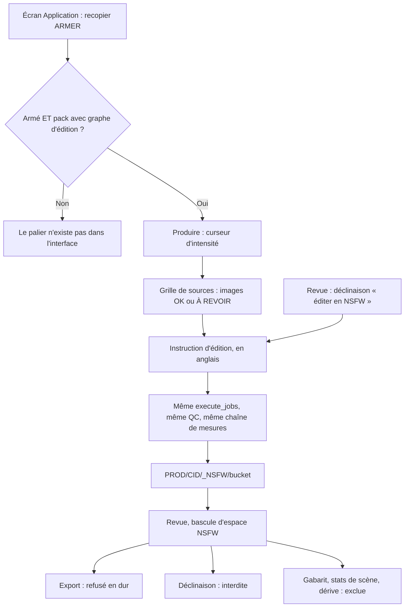
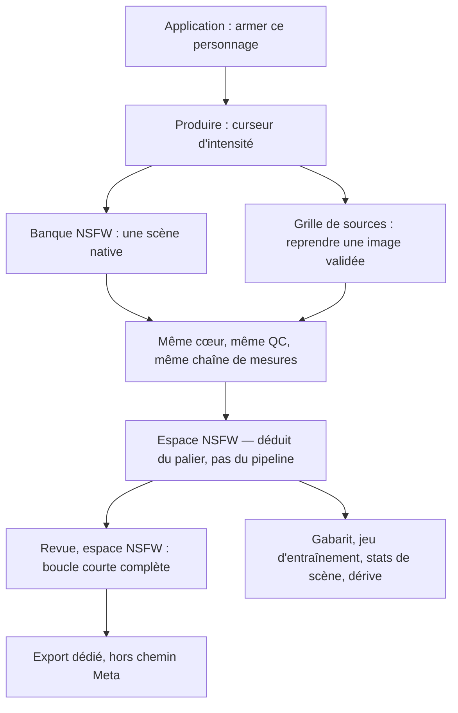

# Le flux d'usage de la branche NSFW

Cadrage ouvert le 2026-09-21, au lendemain de l'ouverture d'IT-3e, à la
demande de Pierre : « un cadrage sur tout ce que doit faire la partie NSFW,
qui est une branche entière — notamment revoir le flux d'utilisation par
l'utilisateur ».

Ce fichier **ne remplace pas** `2026-09-10-capacite-nsfw.md`. Celui-là dit ce
que la branche est en capacité de faire et avec quel instrument on le mesure ;
celui-ci dit ce que l'**utilisateur fait**, de l'armement à la destination du
fichier. Le 10/09 mettait « tout écran » hors périmètre — c'est exactement ce
que cette session rouvre, et c'est sa seule raison d'exister.

Le parcours décrit ici a été relu dans le code, pas dans les documents : le
cadrage du 10/09 est déjà dépassé sur deux points (les mains sont réparées, la
chaîne de validation est commune depuis le 20/09), et la carte d'usage du 28/08
décrit un flux NSFW qui n'a jamais été celui du code.

## Le parcours d'aujourd'hui, lu dans le code

Les quatre paliers, tels que `CHARACTERS/lena/creative.json` les déclare :

| Niveau | Clé | Pipeline | Écrit dans | `espace` en base | Export | Verrou |
|---|---|---|---|---|---|---|
| 0 | sfw | produce | `PROD/<CID>` | `lena` | oui | — |
| 1 | soft | produce | `PROD/<CID>` | `lena` | oui | — |
| 2 | suggestif | produce | `PROD/<CID>` | `lena` | **non** | confirmation |
| 3 | nsfw | edit | `PROD/<CID>/_NSFW` | `nsfw` | non | armement |

Ce que le code garantit déjà, et qui n'est pas à refaire : un seul cœur
d'exécution pour les deux branches (invariant 2), la même chaîne de mesures
depuis le 20/09, un palier qui exige l'armement et ne l'a pas n'est **pas
émis** — le cran est absent de l'interface, pas grisé
(`web/api/routers/bank.py`, `/api/creative`), et l'armement a une seule porte,
l'écran Application, jamais au milieu d'un geste de production
(`screens/AdultContentSection.tsx`).

## Ce que le parcours ne sait pas faire

**1. La branche ne débouche sur rien.** `services/journal.py:97` refuse
l'export d'un fichier dont l'espace est `nsfw` — une ligne, pas un réglage.
Une image NSFW validée reste sur le disque, dans un dossier, sans chemin de
sortie.

**2. L'axe SFW/NSFW est décidé par le pipeline, pas par le niveau.** Seule
l'édition écrit dans `_NSFW`. Conséquence non voulue : le palier 2, déclaré
non exportable, atterrit dans l'arbre SFW, entre dans le gabarit d'identité,
compte dans les badges de ses scènes et dans la dérive. Le niveau qui dit « ne
publie pas ça » et l'espace qui dit « ceci est de la production normale » se
contredisent sur la même image.

**3. La Revue en espace NSFW est un cul-de-sac.** La déclinaison y est
refusée (`review/useSortActions.tsx:135`), l'export n'existe pas : la boucle
courte du studio — produire, juger, repartir de l'image — s'arrête à la
première image. L'utilisateur peut trier, rien de plus.

**4. Aucune scène ne peut être NSFW.** Le mécanisme existe pourtant :
`scene_band` (`runner/prompt.py:322`) déduit la bande de niveaux d'une scène
de ses tenues, et `scene_visible` la filtre. Aucune scène de la banque ne
déclare de minimum au-delà de 2, et aucun palier ne génère au-delà. La voie
native n'est pas bloquée par un manque de mécanisme, mais par un manque de
données et de modèle.

**5. Le corps n'a pas de mesure.** Le tri d'une image NSFW se fait sur des
mesures de visage et de fond. Ce point reste chez le cadrage du 10/09 et la
dette E9 ; il n'est pas rouvert ici, mais il explique pourquoi la destination
ne pouvait pas se décider en septembre.

**6. Détail à ne pas laisser passer.** L'espace SFW s'écrit `'lena'` en base
(`base.py:60`, avec son alias de compatibilité). Un axe de plateforme porte le
nom d'un personnage : c'est l'invariant 7 pris à revers dans les données. La
migration du point suivant est l'occasion d'écrire `sfw`, jamais un chantier à
part.

## Les quatre arbitrages du 21/09

### 1. L'espace suit le niveau, pas le pipeline

Un palier déclaré non exportable écrit dans l'espace NSFW, quel que soit son
pipeline. Le palier 2 y bascule donc.

Conséquences : `espace` se déduit du palier au lieu d'être posé par le chemin
d'écriture ; les lignes existantes se migrent ; la Revue montre le suggestif
du côté NSFW. C'est le **préalable de tous les autres points** — chacun se dit
en « espace », et les déplacer avant que l'axe soit juste reviendrait à les
écrire deux fois.

### 2. La destination : export dédié, identité, mesures

Une image NSFW validée part par un **chemin d'export propre à la branche**,
jamais mêlé à l'export Meta que `PROJET.md` déclare incompatible. Elle
**alimente l'identité** — gabarit et jeu d'entraînement — et elle **compte
dans les stats de scène et la dérive**.

Les trois filtres `i.espace = 'lena'` (`base.py:452`, `:528`, `:612`) sont donc
tous les trois à ouvrir. Et il faut le dire franchement : pris avec
l'arbitrage 1, l'axe `espace` **cesse d'être un critère d'identité**. Le
gabarit ne se filtre plus sur l'espace, il se filtre sur ce qu'il a toujours
vraiment filtré — le seuil, le rôle, le modèle d'embedding. Le filtre ne se
déplace pas : il disparaît.

Deux conséquences à porter avec la décision :

- un jeu d'entraînement exporté peut désormais contenir du nu. Son manifeste
  doit le dire. C'est une donnée de personnage (ADR-0005), jamais une entrée du
  manifeste ComfyUI (invariant 12, amendement du 09/09) ;
- l'export dédié est une destination, pas un format nouveau : il réutilise les
  tailles et formats existants, sinon c'est un sous-système (invariant 9).

### 3. Une banque de scènes NSFW séparée

La voie native prend ses scènes dans une banque à part, pas dans celle du SFW.

Séparation de **données**, pas de sous-système : une scène dont le niveau
minimum est le palier natif n'apparaît à aucun autre cran, `scene_band` et
`scene_visible` le font déjà. Même `execute_jobs`, même curseur, mêmes rôles.

Question ouverte, à trancher **avant la première ligne de code** : à quelle
couche vit cette banque. Recommandation — au **monde**, comme les lieux, les
intentions et les tons, héritée par le personnage avec `origin: world`. C'est
la seule forme qui rende la branche vendable avec un pack (`PROJET.md`,
Monétisation) et qui n'écrive « lena » nulle part.

### 4. Le modèle de la voie native n'est pas rouvert

Le checkpoint du pack de Léna n'est pas fait pour ça ; la question du modèle
— celui de l'édition, un LoRA, un troisième — reste celle du 10/09, point 6,
et son revers se décide avec elle : ouvrir la voie native ouvre la voie du nu
involontaire en SFW. Aucun palier natif ne s'écrit avant cette réponse.

## Le parcours cible

## L'ordre

1. **L'axe espace.** Serveur et migration, aucune dépendance, préalable de
   tout le reste. `'lena'` devient `'sfw'` dans le même passage.
2. **La destination.** L'export dédié d'abord — c'est la plus petite part —
   puis l'ouverture des trois filtres, chacun avec son test.
3. **La Revue NSFW.** La boucle courte rendue possible, ou refusée avec une
   raison affichée plutôt qu'un message qui renvoie là où l'on est déjà.
4. **La banque NSFW et le palier natif**, après la question du modèle (10/09,
   point 6) — jamais avant.

La mesure du corps suit son propre fil, chez le cadrage du 10/09.

## Hors périmètre

- **La mesure du corps et le choix du modèle natif** : ils restent au cadrage
  du 10/09, qui n'est pas refermé par celui-ci.
- **Le NSFW d'un second personnage ou d'un second pack** : contrainte
  permanente du 10/09, point 5. Tout ce qui s'écrit ici doit rester agnostique
  sans pouvoir le prouver — un seul personnage armé, donc `n = 1`.
- **La publication par API**, reportée après V1 par `PROJET.md` pour des
  raisons qui n'ont pas bougé.
- **La retouche manuelle** et l'éditeur photo, qui ne changent pas.
- **Le rendu du tableau de bord**, et la semaine de production d'IT-4 : elle
  produit du NSFW sans le publier, et ce cadrage ne lui ajoute aucun préalable.

## Critère de sortie

Ce cadrage se ferme quand :

- `espace` se déduit du palier, les lignes existantes sont migrées, et un test
  aurait vu une image non exportable rangée du côté publiable ;
- une image NSFW validée sort par un chemin d'export **nommé**, et aucun test
  ne la trouve dans le chemin d'export Meta ;
- les trois filtres `espace = 'lena'` sont alignés sur l'arbitrage 2, chacun
  avec le test qui aurait détecté le mélange ;
- la Revue en espace NSFW offre la même boucle courte que le SFW, ou la refuse
  avec une raison affichée ;
- la banque NSFW a une couche propriétaire écrite et une scène réelle y vit ;
- la carte d'usage (`2026-08-28-flux-usage-studio.md`, § 5) décrit le parcours
  réel et non celui de 2026-08.
